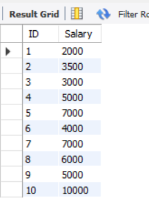

# Introduction to SQL

### Introduction 
This report serves as a step into MySQL and its functionalities. The tasks assigned revolve around creating a database and two distinct tables, each containing unique data. These tasks are designed to establish a basic understanding of MySQL's fundamentals. 

### Problem statement:
1. Create a database named “Staff”
2. Create the following tables with at least 4 constraints for each :
- Staff_Info (ID PK, Name, Age, DOE, Contract_Duration)
- Staff_Salary (ID FK, Salary, Yearly_Increment)
3. Insert 10 rolls of information into both tables
4. Return the name and age of the staff
5. Return ID and Salary of the staffs

From the snapshot above, a database named "Staff” was created. Within the database, two tables were created; "Staff_Info" and "Staff_Salary," each serving unique sets of information.

The process of creating the database is initiated by executing the command:

_CREATE DATABASE (Database name);_

### Similarly, creating tables is achieved through the command:

 _CREATE TABLE (Table name);_ 

### Creating rolls of tables with information, the following syntax used were:

 _USE (Database Name);_

_INSERT INTO "Table_Name" (ID INT AUTO_INCREMENT PRIMARY KEY, Name VARCHAR(30) UNIQUE, Age INT NOT NULL, DOE INT DEFAULT '2023-09-11') VALUES (...);_ _ _

### In creating a table with specific columns, including a Foreign Key as a constraint, the following syntax was used and the snapshot below:

 _USE (Database name);_ 

_CREATE TABLE "table name"
(ID INT NOT NULL,
Salary INT NOT NULL,
Yearly_Increment INT NOT NULL,
FOREIGN KEY (ID) REFERENCES Staff_Info (ID)_

   

The provided syntax indicates how to create and populate ten rows of data within the tables. This serves as a basic into MySQL.

### Selection of Data from Columns:

The snapshot above and below show the selection of data from two specific columns. This was accomplished using the following commands:

### To return all columns from the table:
_SELECT * FROM (table name)_

### To specifically select the "ID" and "Name" columns from the table:

_SELECT ID, Name FROM (table name)_

These commands enable the selection of desired columns from the specified table, offering flexibility in assessing the information needed.

### Conclusion

Completing these tasks not only provided the basics of MySQL but also provided valuable hands-on experience, which is essential for tackling more advanced SQL challenges.
